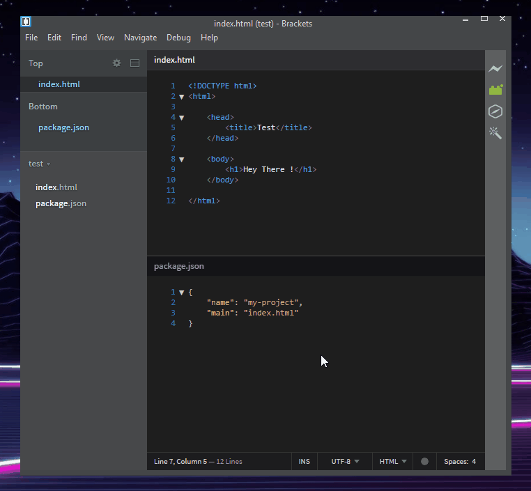

### Brackets Node-Webkit

Run the currently open [Brackets](http://brackets.io/) project using [node-webkit](https://github.com/nwjs/nw.js/) (aka nw.js)

##### To install:

Download this repo and extract it to your extensions folder.  In Brackets from the Help menu click on Show Extensions Folder and then go into the user folder and put it there.

If you don't already have the node-webkit sdk you can get it here https://nwjs.io.  Download it and save it anywhere on your PC 

##### To use:

1. Set the absolute path to nw.exe (from your node-webkit sdk folder) using the 'Set Node-Webkit exe Location' in the file menu.  Put it anywhere on your computer and in it there should be a file called nw.exe, the path of which goes into the set exe location dialog

2. Open a project in Brackets that has a [node-webkit package.json](http://docs.nwjs.io/en/latest/References/Manifest%20Format/) file and its startup file

3. To run your project either: 
    1. Click the Run Node-Webkit button in the toolbar, or 
    2. Use the keyboard shortcut Ctrl+Alt+W, or 
    3. Click Run Node-Webkit Project in the File menu

4. Within few seconds the program should start or an error dialog should display (check the console [F12] if there's any errors for more info)

This program runs node-webkit as you would from the command line, using a node child_process it calls exec(absolute nw.exe path + current Brackets project path)

If you have an invalid node-webkit package.json file, there is a chance this extension can leave node-webkit processes running. 
This is because if an invalid package.json is passed to nw.exe it can fail silently and leave its process running.
A few checks are in place to try to prevent this happening.  If you clicked run and nothing happens, it's likely the nw.exe process is running and you'll have to kill it manually

Here is an example showing where to set the nw.exe path and the button to start node-webkit.  The code shown is the minimum required code for the extension to work

Tested using Brackets 1.10 and node-webkit nwjs-sdk-v0.24.3-win-x64